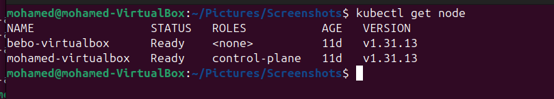
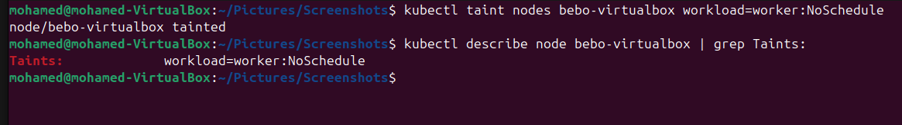

# Lab 15: Node Isolation Using Taints in Kubernetes
🎯 Objective

Demonstrate how to isolate workloads in a Kubernetes cluster by applying a taint to a node, preventing regular pods from being scheduled on it unless they tolerate the taint.
## Step 1: Verify Nodes in the Cluster

## Step 2: Taint the Second Node & Verify the Taint

