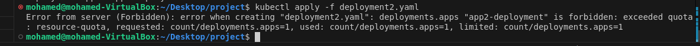

# Lab 16: Namespace Management and Resource Quota Enforcement in Kubernetes

🎯 Objective
Demonstrate how to:
Create a new namespace in Kubernetes.
Apply a ResourceQuota to limit the number of pods that can be created within that namespace.

## Step 1: Create a New Namespace
```bash
kubectl create namespace ivolve
```
## Step 2: Apply the Resource Quota
```bash
kubectl apply -f Resource-quota.yaml
```
##  Step 3:         Exceed limit to test 

