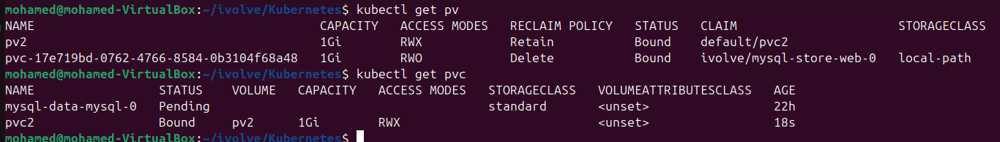
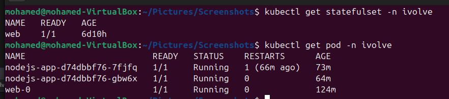
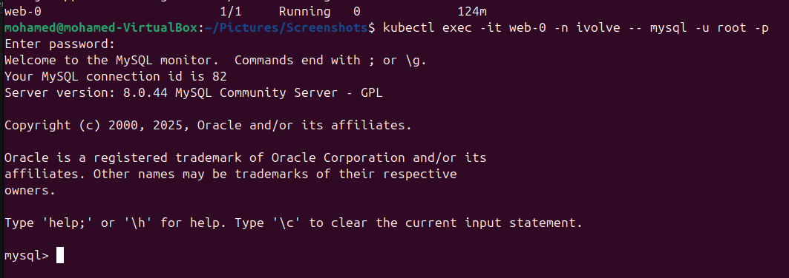
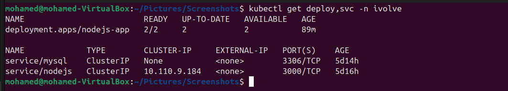
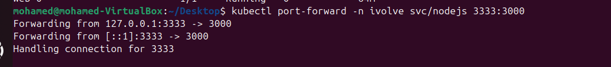
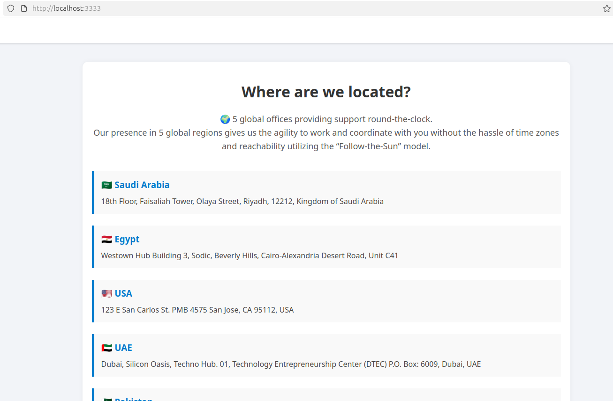
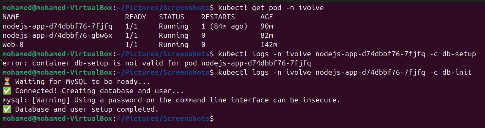
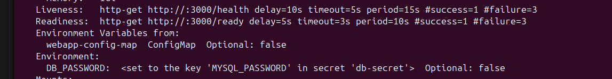
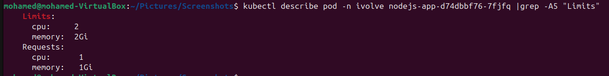

# Labs 17–23: Advanced Kubernetes Application Deployment Series
🎯 Overview

This lab series builds a complete Node.js + MySQL application on Kubernetes, covering:

Configuration and secret management

Persistent storage setup

StatefulSet for MySQL

Node.js deployment and service

Database initialization with init containers

Health checks

Resource requests and limits

## Lab 17: Managing Configuration and Sensitive Data

 🎯 Goal

Separate non-sensitive and sensitive data using ConfigMaps and Secrets.

###  Apply Configmap and Secrets
```bash
kubectl apply -f configmap.yml
kubectl apply -f secrets.yml
```

## Lab 18: Persistent Storage Setup for Application Logging

### Objective
Configure a Persistent Volume (PV) and Persistent Volume Claim (PVC) to store application logs persistently across Pods using Kubernetes **hostPath** storage.

---

###  Step 1 — Prepare Node Directory

Since we are using a `hostPath` volume, the storage directory must exist **on the worker node(s)** where the application Pod will run.

Run the following commands on each **worker node** or using Ansible:

```bash
sudo mkdir -p /mnt/app-logs
sudo chmod 777 /mnt/app-logs
```
This ensures that the path /mnt/app-logs exists and is accessible by all Pods.

### Step 2 — Create Persistent Volume (PV)
```bash
kubectl apply -f pv.yml
```
### Step 3 — Create Persistent Volume Claim (PVC)
```bash
kubectl apply -f pvc.yml
```
### Step 4 — Verify PV and PVC Status
```bash
kubectl get pv
kubectl get pvc
```



NOTE!!

When you don’t specify a storageClassName in the PVC, Kubernetes automatically assigns the default StorageClass,
 If your PV doesn’t have a storageClassName — it’s <unset>
 Therefore, they don’t match, and binding fails

 So you have two options :
 1 - Add storageClassName to the PV same as one assigned to the PVC

 2 - Explicitly in the PVC yaml file set:
   storageClassName: "" 

## Lab 19: StatefulSet Deployment with Headless Service
 🎯 Goal

Deploy MySQL as a StatefulSet with persistent storage and node toleration.

### Steps

1- Create a Headless Service (ClusterIP: None) for MySQL communication between pods.

2- Deploy a MySQL StatefulSet with:

1 replica

Volume mount at /var/lib/mysql

Environment variables from the Secret

Toleration for workload=worker:NoSchedule
```bash
kubectl apply -f statefulset.yml
```

3- Confirm database accessibility using MySQL client:



## Lab 20: Node.js Application Deployment with ClusterIP Service
🎯 Goal

Deploy a Node.js application that connects to MySQL and uses persistent storage for logs.

### Steps

1- Create a Deployment with:

2 replicas

Image from your Docker Hub

Environment variables from ConfigMap and Secret

Mounted PVC for logs

Toleration for workload=worker:NoSchedule

2- Create a ClusterIP Service named nodejs to expose port 3000.

```bash 
kubectl apply -f deployment.yml
kubectl apply -f service.yml
```


3- Port-forward for local testing:





## Lab 21: Init Container for Database Setup
🎯 Goal

Use an init container to prepare the MySQL database before the Node.js app starts.

### Verify init operation



## Lab 22: Health Monitoring of Application Pods
🎯 Goal

Add readiness and liveness probes to monitor app health.

### Steps

Add a readiness probe to check /health endpoint to determine if the app is ready.

Add a liveness probe to periodically check if the app is still running.

```bash
kubectl describe pod -n ivolve nodejs-app-d74dbbf76-7fjfq
```


## Lab 23: Pod Resource Management
🎯 Goal

Set CPU and memory requests and limits for the Node.js app

### Steps

Configure:

Requests → CPU: 1, Memory: 1Gi

Limits → CPU: 2, Memory: 2Gi

Apply updated deployment:
```bash
kubectl apply -f deployment.yml
```
