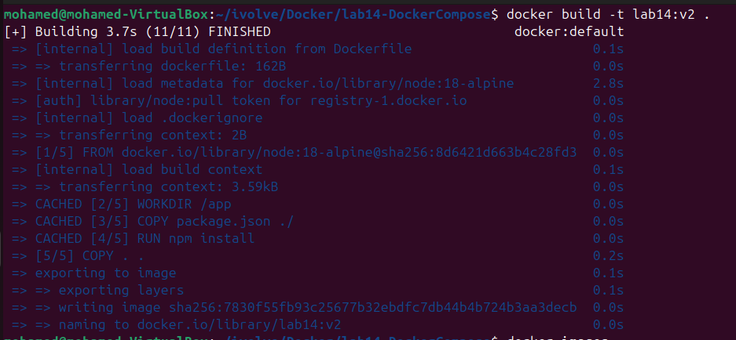
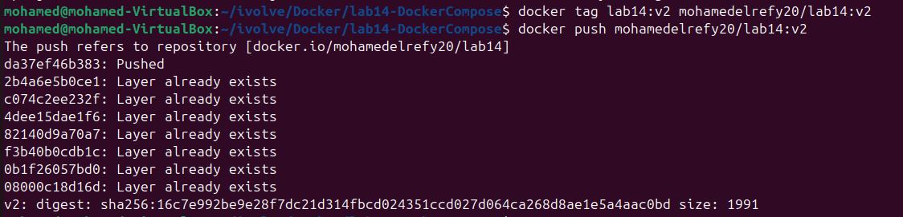
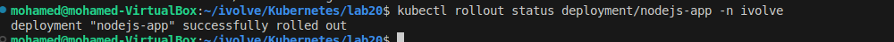
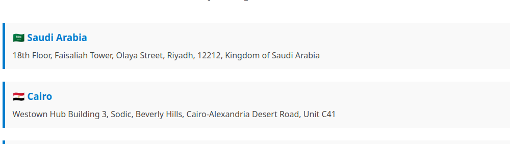
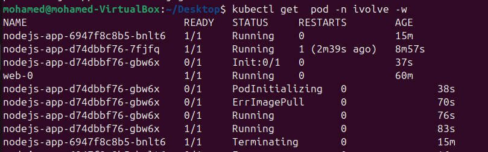
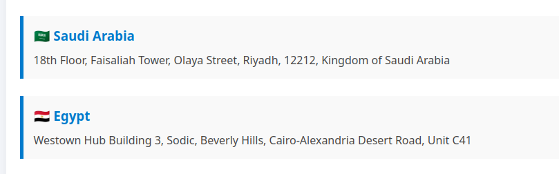

# 🚀 Deployment Update and Rollback Guide
This guide demonstrates how to update an application, build and push a new Docker image, apply the changes to a Kubernetes deployment, and then perform a rollback if needed.

## Step 1: changing app code 'Egpyt' --> 'Cairo'
## Step 2: Build a New Docker Image
 

## Step 3: Push the Image to Docker Hub
 

## Step 4: Update the Deployment Manifest

Update your Kubernetes deployment YAML file with the new image version:
image: <your-dockerhub-username>/nodejs-app:v2

## Step 5: Apply the Deployment and Check Rollout Status
```bash
kubectl apply -f deployment.yaml
kubectl rollout status deployment nodejs-app -n ivolve
```


## Step 6: Verify Application Update


## Step 7: Roll Back to the Previous Version
```bash
kubectl rollout undo deployment nodejs-app -n ivolve
```
# Step 8: Monitor Pods During Rollback


# Step 9: Verify Rollback

